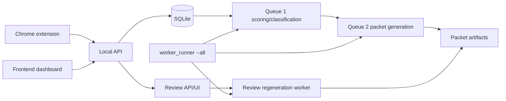

# JobAgent V2

JobAgent V2 is a local-first job application workflow for capturing job
postings, scoring them, selecting one of four immutable CV families, generating
auditable packet artifacts, reviewing decisions, and regenerating reviewed
packets without free-form resume prose.

Current release candidate: `job-agent-v2 v0.1.0`.

The product boundary is intentionally narrow:

- Local SQLite storage and local filesystem artifacts.
- Four supported CV families: `digital_ic`, `verification`, `software`, `ml`.
- Canonical master CVs and approved project blocks are immutable.
- Tailoring is bounded to at most one approved whole-project substitution.
  Project selection is requirement-aware and can consider approved bridge
  projects across families without changing the selected base CV family.
- Deterministic behavior is the default; semantic evidence is opt-in.
- Duplicate capture returns structured outcomes for active, completed, failed,
  and archived jobs. Archived jobs are restored and re-scored instead of being
  duplicated.
- Review history, regeneration jobs, worker status, and packet attempts are
  persisted for auditability.
- This is not a hosted multi-user production service.



## Repository Layout

```text
backend/      Python package, local API, workers, migrations, tests
frontend/     Static dashboard for local operation
extension/    Chrome extension for local job capture
master-cvs/   Approved immutable .tex/.pdf family masters
docs/         Operational, review, calibration, and release documentation
scripts/      Release startup, smoke, and validation commands
project/      Current milestone, roadmap, and history
```

## Quick Start

```bash
git clone <repo-url>
cd job-agent-v2
./scripts/setup-local
# Edit .env.local and add JOBAGENT_LLM_API_KEY
./scripts/dev-up --open
```

Then open:

```text
Frontend: http://127.0.0.1:5173
API:      http://127.0.0.1:8765
```

`.env.local` is ignored by git and is never printed by the local scripts.
`.env.example` is safe to commit and contains placeholders only. Live semantic
classification uses `JOBAGENT_LLM_API_KEY`; provider calls may incur charges.

## Install

Use Python 3.11 or newer. From a clean checkout:

```bash
python3 -m venv .venv
source .venv/bin/activate
pip install -e ".[dev]"
```

Node is only needed for the lightweight frontend/extension checks run by
`scripts/check.py`. No live LLM credentials are required for deterministic
operation.

## Preflight

Run local diagnostics before starting the stack:

```bash
PYTHONPATH=backend/src python3 -m jobagent_v2.preflight
```

Preflight validates Python packages, writable data/artifact directories,
canonical master CV registration, one-page readable master PDFs, project-block
and classifier/tailoring config readability, database initialization/migration,
frontend and extension files, required ports, and LaTeX availability.

If `pdflatex` is unavailable, preflight warns by default. Master-copy packet
generation can still use the approved PDFs, while tailored packet compilation
and reviewed tailored regeneration require a TeX toolchain.

Inspect the database schema without starting services:

```bash
PYTHONPATH=backend/src python3 -m jobagent_v2.db_status --db-path data/jobagent_v2.sqlite3
```

## Configuration

Local defaults are safe for a single developer:

```text
API:       127.0.0.1:8765
Frontend: 127.0.0.1:5173
Database: data/jobagent_v2.sqlite3
Artifacts: data/artifacts
Owner:     local
```

The supported local setup command creates `.venv`, installs development
dependencies, copies `.env.example` to `.env.local` only when needed, and
creates the configured local data directories:

```bash
./scripts/setup-local
```

`.env.local` is loaded automatically by `./scripts/dev-up`, preflight, database
status, worker, regeneration, calibration, and live LLM smoke commands. It is
ignored by git. Existing shell environment variables take precedence over
values in `.env.local`, so one-off overrides still work.

To test live semantic classification locally, set this exact key variable in
`.env.local`:

```dotenv
JOBAGENT_LLM_API_KEY=
```

Disable live semantic calls with:

```dotenv
JOBAGENT_LLM_ENABLED=false
```

When disabled, the application uses the deterministic paths already implemented
for offline operation. Startup never makes a live network call merely to
validate the key. It rejects missing keys when `JOBAGENT_LLM_ENABLED=true` and
rejects obvious placeholder values such as `YOUR_API_KEY_HERE`, `replace-me`,
and `changeme`.

The default `.env.example` stores local test data under:

```text
data/local-test/jobagent.sqlite3
data/local-test/artifacts
```

It does not use or delete `data/jobagent_v2.sqlite3`.

Example live semantic settings:

```dotenv
JOBAGENT_LLM_ENABLED=true
JOBAGENT_LLM_API_KEY=your-local-key
JOBAGENT_LLM_MODEL=gpt-5.4-mini
```

Supported environment overrides:

```text
JOBAGENT_API_HOST
JOBAGENT_API_PORT
JOBAGENT_FRONTEND_HOST
JOBAGENT_FRONTEND_PORT
JOBAGENT_DATA_DIR
JOBAGENT_ARTIFACT_DIR
JOBAGENT_DB_PATH
JOBAGENT_OWNER_ID
JOBAGENT_Q1_POLL_SECONDS
JOBAGENT_Q2_POLL_SECONDS
JOBAGENT_REGENERATION_POLL_SECONDS
JOBAGENT_HEARTBEAT_SECONDS
JOBAGENT_STALE_PROCESSING_SECONDS
JOBAGENT_MAX_RETRY_ATTEMPTS
JOBAGENT_LLM_ENABLED
JOBAGENT_LLM_MODEL
JOBAGENT_LLM_API_KEY
JOBAGENT_LATEX_EXECUTABLE
JOBAGENT_LOG_LEVEL
```

## Start Locally

One supported startup path:

```bash
./scripts/dev-up
```

Equivalent Python entry point:

```bash
python3 scripts/dev_up.py
```

This loads `.env.local`, prints a safe LLM summary, runs preflight, checks
ports, initializes/migrates the configured database, then starts the API server,
continuous worker runner, and frontend static server. Press `Ctrl-C` to stop
only child processes started by the script. Use `--open` to open the frontend
explicitly.

Stop a previously launched stack from another terminal:

```bash
./scripts/dev-down
```

Check local status without printing secrets:

```bash
./scripts/dev-status
```

If a configured port is occupied, startup reports the port, the PID/command
where available, and an `lsof` command to inspect it. It does not kill unrelated
processes. If the process appears to be from a previous supported startup, run
`./scripts/dev-down`.

Separate-terminal startup remains supported:

```bash
PYTHONPATH=backend/src python3 -m jobagent_v2.server
PYTHONPATH=backend/src python3 -m jobagent_v2.worker_runner --all
python3 -m http.server 5173 --bind 127.0.0.1 --directory frontend/src
```

Run one worker type if needed:

```bash
PYTHONPATH=backend/src python3 -m jobagent_v2.worker_runner --worker q1
PYTHONPATH=backend/src python3 -m jobagent_v2.worker_runner --worker q2
PYTHONPATH=backend/src python3 -m jobagent_v2.worker_runner --worker regeneration
```

Worker operations, health rules, queue metrics, stale recovery, and
troubleshooting are documented in `docs/worker_operations.md`.

## Daily Use

1. Start the stack.
2. Capture a job with the Chrome extension or create it through the local API.
3. Use the dashboard Jobs view to see each job's plain-language workflow state,
   candidate-fit score, CV-family classification, semantic-analysis status,
   packet status, and next action.
4. Let the scoring worker score and classify the job.
5. Let the packet worker generate a canonical or bounded-tailored packet.
6. Review classification/tailoring decisions when surfaced.
6. Resolve the review; eligible packet-changing resolutions queue
   regeneration.
7. The regeneration worker creates a linked reviewed packet version or records
   a safe failure while preserving prior ready packets.
8. Monitor worker, queue, semantic LLM, and demo-data status in the dashboard
   System view or through `/api/workers/status`.

Dashboard navigation:

- `Jobs`: the main workflow. A compact job list selects one job, then the
  detail panel shows the current stage, one recommended next action, the key
  result, and collapsed deeper details.
- `Reviews`: an inbox for decisions that need attention. The detail view walks
  through recommendation, project/CV change, and confirmation instead of
  showing every control at once.
- `System`: operational status for API, workers, queues, semantic provider,
  local database/demo cleanup, and safe diagnostics.

The Jobs page uses this user-facing stage model:

```text
Added -> Analysing role -> Choosing CV -> Generating packet -> Ready
```

Review branches are shown as `Needs review`, `Reviewed`, `Regenerating`, and
`Reviewed packet ready`. Queue names, worker IDs, classifier versions, registry
versions, packet IDs, and raw status values are hidden from normal use and live
under advanced disclosure sections or the System page.

The frontend visual style is intentionally minimal retro: warm off-white
surfaces, thin borders, compact monospace status labels, square progress
markers, and one muted accent color. It is meant to feel like a clean local
workstation interface rather than a debugging console or fake terminal.

## Base CV Versus Project Portfolio

JobAgent separates two decisions:

1. **Base CV family**: which immutable master CV gives the best overall
   narrative and skills framing for the role.
2. **Project portfolio**: which approved whole-project blocks best cover the
   role's grounded requirements.

The base family remains one of Digital IC / RTL, Verification, Software, or
Machine Learning. It does not create a hard project boundary. For example, a
Machine Learning role with explicit NPU, accelerator, quantization, or
hardware-aware inference requirements can shortlist an approved Digital IC
bridge project such as TinyNPU. Automatic substitution still requires an
approved compatibility pair, meaningful requirement-coverage gain, one-page
validation, and the one-substitution limit. Borderline cross-family choices are
sent to review rather than silently inserted.

The Jobs detail view shows the conclusion first: base CV, project portfolio,
and why a project was included or surfaced for review. Requirement coverage,
alternative portfolio scores, and technical scoring details remain under
disclosures.

Candidate fit estimates how suitable a role is for you. CV-family
classification is separate: it chooses which immutable resume family best
matches the role. Decisions display as Clear match, Mixed role, Close decision,
or Low confidence.

Semantic status values are `live_success`, `disabled`, `not_configured`,
`fallback_used`, `request_failed`, `response_invalid`, `timed_out`, and
`not_attempted`. Run the explicit diagnostic without network:

```bash
./scripts/semantic-check --no-network
```

Run one live diagnostic only when `.env.local` contains a real key:

```bash
./scripts/semantic-check
```

It prints status, model, latency, selected family, and evidence count. It never
prints the API key and does not write to the jobs database. A live run may incur
provider cost.

Semantic requirement extraction is separate from family classification. The
deterministic requirement extractor always remains the fallback. When semantic
requirements are explicitly enabled through
`JOBAGENT_SEMANTIC_REQUIREMENTS_ENABLED=true`, semantic output must use the
approved capability ontology, quote text from the job description, pass
grounding/negation checks, and then fuse conservatively with deterministic
requirements before project selection. Semantic-only requirements are
discounted and cannot bypass eligible-family rules, approved project blocks,
one-substitution policy, review thresholds, or one-page validation.

Check semantic requirement extraction without network:

```bash
./scripts/semantic-requirements-check --no-network
PYTHONPATH=backend/src python3 scripts/evaluate_semantic_requirements.py
```

The fake diagnostic reports `simulated_success`. It prints accepted and
rejected requirement counts plus normalized capabilities, never API keys, and
does not write to the jobs database.

## Duplicate Capture And Re-Scoring

Capturing an existing job distinguishes:

- `existing_active`: the job already has an active analysis run.
- `existing_complete`: the job already has completed analysis and can be opened
  or re-scored.
- `existing_archived`: the job is hidden in the archive and should be restored
  or restored and re-scored.
- `existing_failed`: the previous analysis failed and can be retried/re-scored.

Restore only marks an archived job active again. Restore and re-score creates a
new versioned analysis run and preserves earlier scores, packets, reviews, and
audit history. Re-score uses the captured job content already stored locally; it
does not silently fetch the live posting again.

Review API behavior is documented in `docs/review_api.md`. Bounded tailoring is
documented in `docs/bounded_tailoring.md`. Calibration evaluation is documented
in `docs/calibration.md`.

## Smoke Test

Run a deterministic end-to-end release smoke flow with isolated temporary data:

```bash
python3 scripts/release_smoke.py
```

The smoke test initializes a temporary database and artifact root, creates a
synthetic Digital IC job, runs Queue 1, runs Queue 2, creates and resolves a
classification review, runs reviewed regeneration, verifies packet versioning,
checks worker status data, and exits nonzero on failure.

## Demo Data

Seed seven deterministic synthetic examples into the database configured by
`.env.local`:

```bash
./scripts/demo-local
```

This never runs during normal startup. It refuses the default production-style
database unless `--allow-default-db` is supplied. Future demo jobs are
explicitly marked with `source_provenance: demo`.

The lower-level helper can still seed a separate explicit demo database:

```bash
python3 scripts/demo_seed.py
```

The default target is `data/demo_jobagent_v2.sqlite3`, not the normal local
database. The examples cover clear Digital IC, Verification, Software, ML,
hybrid Digital IC/ML, close Verification/Software, and out-of-scope roles.

Remove only explicitly marked demo jobs:

```bash
./scripts/clear-demo-jobs
./scripts/clear-demo-jobs --yes
```

The command previews affected demo jobs, reviews, packets, and generated
artifact directories. It preserves manual, extension, imported, and real jobs;
it never touches canonical master CVs or approved project-block files. The
dashboard System view exposes the same owner-scoped safe cleanup action.

Individual jobs can be deleted from the detail view. Demo/test jobs are hard
deleted with linked database records. Manual, extension, and imported jobs are
archived instead, so audit records remain consistent and the job disappears
from the default list.

Analysis history is stored as versioned analysis runs. Legacy job summary fields
remain for compatibility, while previous run records and previous packet
artifacts remain accessible.

## Full Validation

Run the repository check:

```bash
python3 scripts/check.py
git diff --check
git status --short
```

`scripts/check.py` runs backend tests plus frontend and extension checks. Local
TeX-dependent tests skip when the TeX toolchain is unavailable.

## Chrome Extension

Load `extension/` as an unpacked Chrome extension during local development. It
posts captured job data to the local API and reports local API availability
errors in the popup. It does not store API keys.

## Privacy And Logs

The repository is designed for local operation. Logs and worker events use safe
identifiers and error codes. They should not include full CV text, phone
numbers, email addresses, full private job descriptions, review notes, semantic
API keys, or raw prompts containing private content.

Before moving or sharing a checkout, inspect `data/` and generated artifacts.

## Migration And Recovery

SQLite schema initialization is idempotent. Startup refuses databases with a
newer unsupported schema version. Back up `data/jobagent_v2.sqlite3` before
manual migration experiments.

Failures do not delete prior ready packet artifacts. Temporary or failed packet
build directories may be inspected under the configured artifact root; valid
packet directories should not be removed by cleanup scripts.

## Release Docs

- `docs/release_checklist.md`
- `docs/worker_operations.md`
- `docs/review_api.md`
- `docs/bounded_tailoring.md`
- `docs/calibration.md`
- `CHANGELOG.md`

Authoritative active milestone state lives in `project/current.md`.
