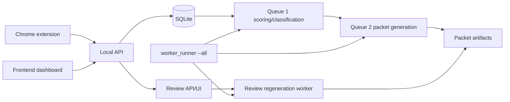

# JobAgent V2

JobAgent V2 is a local-first job application workflow for capturing job
postings, scoring them, selecting one of four immutable CV families, generating
auditable packet artifacts, reviewing decisions, and regenerating reviewed
packets without free-form resume prose.

Current release candidate: `job-agent-v2 v0.1.0`.

The product boundary is intentionally narrow:

- Local SQLite storage and local filesystem artifacts.
- Four supported CV families: `digital_ic`, `verification`, `software`, `ml`.
- Canonical master CVs and approved project blocks are immutable.
- Tailoring is bounded to at most one approved whole-project substitution.
- Deterministic behavior is the default; semantic evidence is opt-in.
- Review history, regeneration jobs, worker status, and packet attempts are
  persisted for auditability.
- This is not a hosted multi-user production service.



## Repository Layout

```text
backend/      Python package, local API, workers, migrations, tests
frontend/     Static dashboard for local operation
extension/    Chrome extension for local job capture
master-cvs/   Approved immutable .tex/.pdf family masters
docs/         Operational, review, calibration, and release documentation
scripts/      Release startup, smoke, and validation commands
project/      Current milestone, roadmap, and history
```

## Install

Use Python 3.11 or newer. From a clean checkout:

```bash
python3 -m venv .venv
source .venv/bin/activate
pip install -e ".[dev]"
```

Node is only needed for the lightweight frontend/extension checks run by
`scripts/check.py`. No live LLM credentials are required for deterministic
operation.

## Preflight

Run local diagnostics before starting the stack:

```bash
PYTHONPATH=backend/src python3 -m jobagent_v2.preflight
```

Preflight validates Python packages, writable data/artifact directories,
canonical master CV registration, one-page readable master PDFs, project-block
and classifier/tailoring config readability, database initialization/migration,
frontend and extension files, required ports, and LaTeX availability.

If `pdflatex` is unavailable, preflight warns by default. Master-copy packet
generation can still use the approved PDFs, while tailored packet compilation
and reviewed tailored regeneration require a TeX toolchain.

Inspect the database schema without starting services:

```bash
PYTHONPATH=backend/src python3 -m jobagent_v2.db_status --db-path data/jobagent_v2.sqlite3
```

## Configuration

Local defaults are safe for a single developer:

```text
API:       127.0.0.1:8765
Frontend: 127.0.0.1:5173
Database: data/jobagent_v2.sqlite3
Artifacts: data/artifacts
Owner:     local
```

Environment overrides:

```text
JOBAGENT_API_HOST
JOBAGENT_API_PORT
JOBAGENT_FRONTEND_HOST
JOBAGENT_FRONTEND_PORT
JOBAGENT_DATA_DIR
JOBAGENT_ARTIFACT_DIR
JOBAGENT_DB_PATH
JOBAGENT_OWNER_ID
JOBAGENT_Q1_POLL_SECONDS
JOBAGENT_Q2_POLL_SECONDS
JOBAGENT_REGENERATION_POLL_SECONDS
JOBAGENT_HEARTBEAT_SECONDS
JOBAGENT_STALE_PROCESSING_SECONDS
JOBAGENT_MAX_RETRY_ATTEMPTS
JOBAGENT_LLM_ENABLED
JOBAGENT_LLM_MODEL
JOBAGENT_LLM_API_KEY
JOBAGENT_LATEX_EXECUTABLE
JOBAGENT_LOG_LEVEL
```

Displayed configuration redacts credentials.

## Start Locally

One supported startup path:

```bash
./scripts/dev-up
```

Equivalent Python entry point:

```bash
python3 scripts/dev_up.py
```

This runs preflight, checks ports, then starts the API server, continuous worker
runner, and frontend static server. Press `Ctrl-C` to stop child processes.
Use `--open` to open the frontend explicitly.

Separate-terminal startup remains supported:

```bash
PYTHONPATH=backend/src python3 -m jobagent_v2.server
PYTHONPATH=backend/src python3 -m jobagent_v2.worker_runner --all
python3 -m http.server 5173 --bind 127.0.0.1 --directory frontend/src
```

Run one worker type if needed:

```bash
PYTHONPATH=backend/src python3 -m jobagent_v2.worker_runner --worker q1
PYTHONPATH=backend/src python3 -m jobagent_v2.worker_runner --worker q2
PYTHONPATH=backend/src python3 -m jobagent_v2.worker_runner --worker regeneration
```

Worker operations, health rules, queue metrics, stale recovery, and
troubleshooting are documented in `docs/worker_operations.md`.

## Daily Use

1. Start the stack.
2. Capture a job with the Chrome extension or create it through the local API.
3. Let Queue 1 score and classify the job.
4. Let Queue 2 generate a canonical or bounded-tailored packet.
5. Review classification/tailoring decisions when surfaced.
6. Resolve the review; eligible packet-changing resolutions queue
   regeneration.
7. The regeneration worker creates a linked reviewed packet version or records
   a safe failure while preserving prior ready packets.
8. Monitor worker and queue health in the dashboard or through
   `/api/workers/status`.

Review API behavior is documented in `docs/review_api.md`. Bounded tailoring is
documented in `docs/bounded_tailoring.md`. Calibration evaluation is documented
in `docs/calibration.md`.

## Smoke Test

Run a deterministic end-to-end release smoke flow with isolated temporary data:

```bash
python3 scripts/release_smoke.py
```

The smoke test initializes a temporary database and artifact root, creates a
synthetic Digital IC job, runs Queue 1, runs Queue 2, creates and resolves a
classification review, runs reviewed regeneration, verifies packet versioning,
checks worker status data, and exits nonzero on failure.

## Demo Data

Seed deterministic synthetic examples into a separate demo database:

```bash
python3 scripts/demo_seed.py
```

The default target is `data/demo_jobagent_v2.sqlite3`, not the normal local
database. The examples cover clear Digital IC, Verification, Software, ML,
hybrid Digital IC/ML, close Verification/Software, and out-of-scope roles.

## Full Validation

Run the repository check:

```bash
python3 scripts/check.py
git diff --check
git status --short
```

`scripts/check.py` runs backend tests plus frontend and extension checks. Local
TeX-dependent tests skip when the TeX toolchain is unavailable.

## Chrome Extension

Load `extension/` as an unpacked Chrome extension during local development. It
posts captured job data to the local API and reports local API availability
errors in the popup. It does not store API keys.

## Privacy And Logs

The repository is designed for local operation. Logs and worker events use safe
identifiers and error codes. They should not include full CV text, phone
numbers, email addresses, full private job descriptions, review notes, semantic
API keys, or raw prompts containing private content.

Before moving or sharing a checkout, inspect `data/` and generated artifacts.

## Migration And Recovery

SQLite schema initialization is idempotent. Startup refuses databases with a
newer unsupported schema version. Back up `data/jobagent_v2.sqlite3` before
manual migration experiments.

Failures do not delete prior ready packet artifacts. Temporary or failed packet
build directories may be inspected under the configured artifact root; valid
packet directories should not be removed by cleanup scripts.

## Release Docs

- `docs/release_checklist.md`
- `docs/worker_operations.md`
- `docs/review_api.md`
- `docs/bounded_tailoring.md`
- `docs/calibration.md`
- `CHANGELOG.md`

Authoritative active milestone state lives in `project/current.md`.
